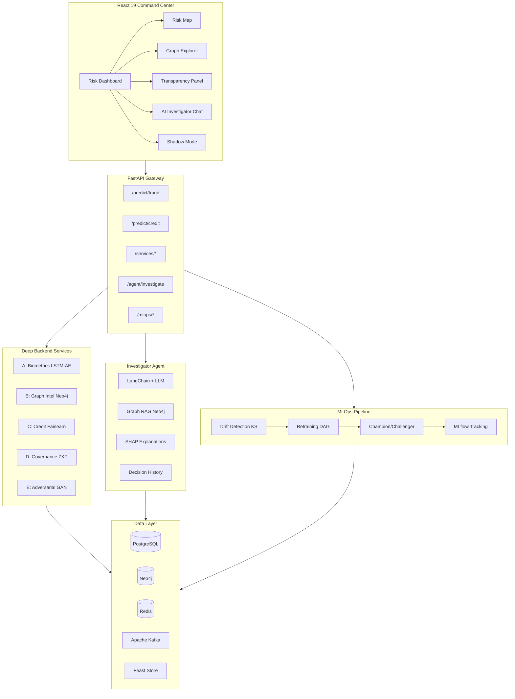

# FinGuard 2026

> **Autonomous Fraud Prevention & Inclusive Credit Scoring**

A production-grade financial intelligence platform combining **Graph Neural Networks**, **Temporal Fusion Transformers**, **Behavioral Biometrics**, and **Adversarial AI** for real-time fraud detection — alongside **alternative credit scoring** for unbanked populations. **Phase 2** adds MLOps orchestration, an LLM-powered Investigator Agent, and full enterprise deployment infrastructure.

---

## System Architecture



## Tech Stack

| Layer     | Technology                                                               |
| --------- | ------------------------------------------------------------------------ |
| Frontend  | React 19, TypeScript, Tailwind CSS, Recharts, Lucide Icons               |
| Backend   | FastAPI, Pydantic, Uvicorn, Gunicorn                                     |
| ML        | PyTorch, PyTorch Geometric, XGBoost, Fairlearn, SHAP                     |
| Databases | PostgreSQL (users/audit), Neo4j (graphs), Redis (sessions)               |
| Streaming | Apache Kafka (Redpanda), Feast Feature Store                             |
| MLOps     | MLflow (tracking/registry), Airflow-compatible DAGs, Champion/Challenger |
| Agent     | LangChain, Graph RAG, Ollama/Llama 3                                     |
| Privacy   | Flower (Federated Learning), ZKP Commitments, Differential Privacy       |
| Security  | JWT/OAuth2, HashiCorp Vault, Bandit/Safety                               |
| DevOps    | Docker, Kubernetes (HPA), GitHub Actions CI/CD, Prometheus, Grafana      |

## Quick Start

```bash
# Backend
python -m venv .venv && source .venv/Scripts/activate
pip install -e ".[dev]"
python -m data.synthetic.generate_synthetic --n_transactions 10000
python -m api.main  # → http://localhost:8000/docs

# Frontend
cd frontend && npm install && npm run dev  # → http://localhost:5173

# CLI Investigator
python -m agent.cli

# Full Stack (Docker)
docker-compose up -d
```

## API Endpoints

| Method | Endpoint                                  | Description                   |
| ------ | ----------------------------------------- | ----------------------------- |
| `GET`  | `/health`                                 | Health check                  |
| `POST` | `/api/v1/predict/fraud`                   | Real-time fraud scoring       |
| `POST` | `/api/v1/predict/credit`                  | Alternative credit scoring    |
| `POST` | `/api/v1/explain/{id}`                    | SHAP reason codes             |
| `POST` | `/api/v1/services/biometrics/analyze`     | Service A: Session analysis   |
| `POST` | `/api/v1/services/graph/analyze`          | Service B: Risk contagion     |
| `GET`  | `/api/v1/services/graph/cycles`           | Service B: Laundering cycles  |
| `POST` | `/api/v1/services/credit/underwrite`      | Service C: Bias-aware scoring |
| `POST` | `/api/v1/services/governance/reason-memo` | Service D: JSON memo          |
| `POST` | `/api/v1/services/governance/zkp/create`  | Service D: ZKP proof          |
| `POST` | `/api/v1/services/governance/zkp/verify`  | Service D: ZKP verify         |
| `POST` | `/api/v1/services/adversarial/test`       | Service E: Robustness test    |
| `POST` | `/api/v1/agent/investigate`               | AI Investigator query         |
| `GET`  | `/api/v1/agent/tools`                     | List investigation tools      |
| `GET`  | `/api/v1/mlops/drift-status`              | Model drift status            |
| `POST` | `/api/v1/mlops/retrain`                   | Trigger retraining            |
| `GET`  | `/api/v1/mlops/serving-status`            | Champion/Challenger status    |
| `GET`  | `/api/v1/mlops/experiments`               | MLflow experiments            |

## Expanded Administrative & Intelligence Services

The platform features deep, production-grade administrative modules and settings persistence:

### 1. Advanced Consoles & Risk Simulators
* **Payment Intelligence**: UPI/SWIFT velocity windows, offshore proxy risk toggle, 3DS enforcement threshold adjustment, and simulated ledger receipt gateway logs.
* **Wealth & Risk Console**: Real-time PEP & sanctions list checking, MiFID II KYC suitability certificate generation, and portfolio market-shock simulators graphing equities/interest rates impacts on VaR.
* **RegTech & Compliance**: Interactive SAR (Suspicious Activity Report) generator, ML-DSA cryptographic envelopes, and transmission status terminal logs.
* **Database Link**: Active integration dashboard displaying simulated PostgreSQL ingestion streams, live throughput rates, and table metrics.

### 2. Persisted Settings & Accessibility
* **Stateful Theme Switching**: Unified support for `Dark Mode`, `Light Mode`, and `High-Contrast` palettes synchronized across all components.
* **Typography Scaling**: Choose between Satoshi Display, Atkinson Mono, or standard system sans-serif typefaces.
* **Zustand Persistence**: All custom sliders, notification settings, and display preferences are automatically saved in local browser storage.

### 3. Notifications & Audit Trail
* **Notifications Center** (`/admin/notifications`): Real-time alert feed with filtering by type, severity, and read status. Supports bulk mark-as-read, pin, dismiss, and CSV export. New notifications auto-stream every 20–40 seconds.
* **Notification Bell**: Header-bar bell icon with unread count badge and dropdown preview of recent alerts.
* **Audit Trail** (`/admin/audit`): Immutable event log with paginated table, event density timeline visualization, module/severity filters, full JSON payload detail drawer, and CSV export.

### 4. Dashboard Activity & Quick Actions
* **Activity Timeline**: Scrollable feed of recent system events (fraud alerts, model promotions, federation rounds, key rotations) with timestamps, icons, and connector lines.
* **Quick Action Cards**: One-click navigation to key workflows — Run Fraud Review, Score Applicant, Detect Graph Cycles, Generate SAR, View Audit Trail, and Rotate Keys.

### 5. Interactive Credit Portal
* **Live Score Calculator**: Adjust alternative data inputs (SIM tenure, payment rates, top-up regularity) via sliders and compute trust scores with animated results and SHAP-style factor attribution.
* **Document Checklist**: Interactive progress-tracked document list with checkbox toggling, required/optional badges, and eligibility status bar.

## Project Structure

```
finguard/
├── frontend/            # React 19 + TypeScript Command Center
│   └── src/components/  # MetricsCards, RiskChart, GraphView, TransparencyPanel, InvestigatorChat
├── api/                 # FastAPI gateway, 8 routers, auth middleware
├── services/            # 5 deep-backend microservices (A-E)
├── agent/               # LLM Investigator Agent (LangChain + Graph RAG + CLI)
├── mlops/               # MLflow tracking, retraining DAG, champion/challenger
├── models/              # ML architectures (GraphSAGE, TFT, CNN+LSTM, Ensemble, XGBoost, SSL)
├── database/            # PostgreSQL ORM, Neo4j client, Redis client, schemas
├── auth/                # JWT, Vault secrets management
├── ingestion/           # Kafka producer/consumer, stream processor
├── feature_store/       # Feast config and feature views
├── privacy/             # Federated Learning + SHAP explainability
├── monitoring/          # Drift detection, Prometheus, alerting
├── k8s/                 # Kubernetes manifests (HPA, Ingress, Phase 2)
├── .github/workflows/   # CI/CD pipelines (test, lint, security, deploy)
└── tests/               # Comprehensive test suite
```

## License

MIT
